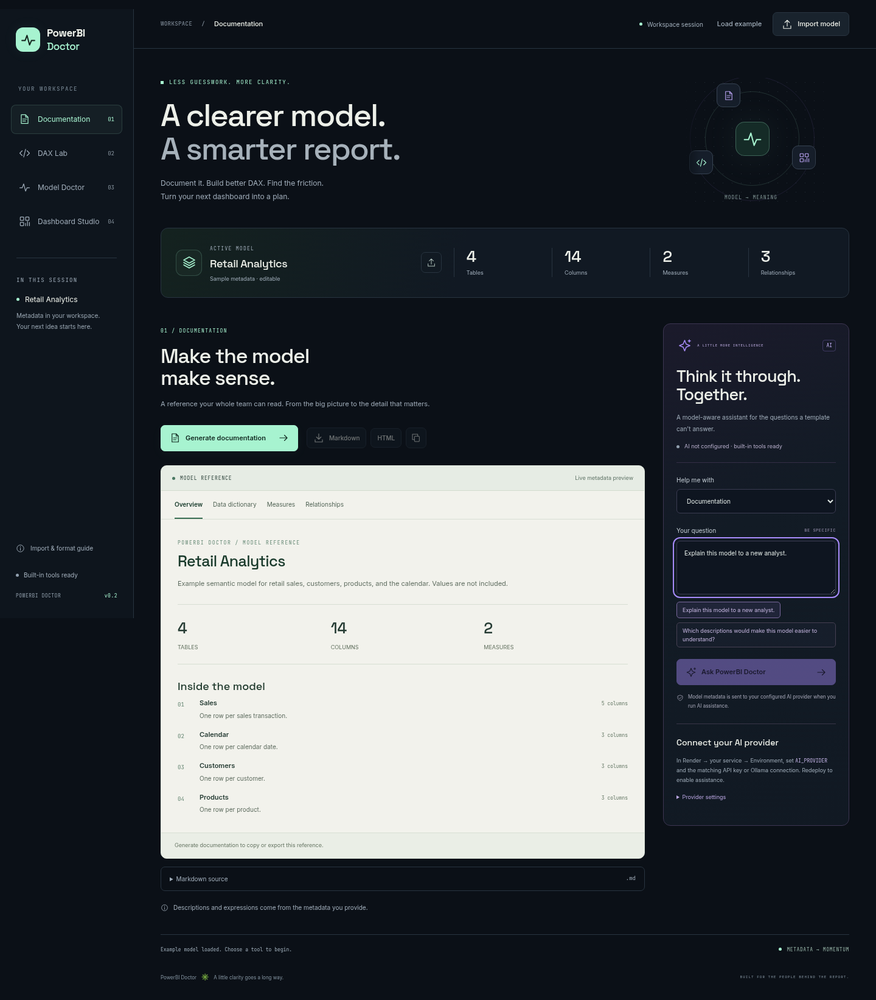

# PowerBI Doctor

Your own Power BI development workspace: documentation, DAX assistance, model diagnostics, and dashboard design. Built for `avinashpandey3/powerbi-doc` and the existing Render service at https://powerbi-doc.onrender.com/.



## What you can do

| Workspace | Built-in tools, available without an API key | AI assistance when configured |
| --- | --- | --- |
| Documentation | Model overview, data dictionary, saved DAX measures, relationships; Markdown and standalone HTML exports | Explain and improve documentation using your model metadata |
| DAX assistant | Eleven recipes: total, count, distinct, average, min, max, share, YTD, previous month, YoY, rolling 30 days; expression review | Create, explain, debug, and optimize DAX; Power Query M questions |
| Model Doctor | Explained metadata health score, categorized findings, relationship map, missing types, sampled inference, duplicate names, and relationship type checks | Deeper semantic model and filter-context recommendations |
| Dashboard Studio | Field-bound layout previews, blueprint JSON, four Power BI theme palettes, build guides, suggested measures, and eligible Deneb/Vega-Lite specs | Develop the brief, measures, visual choices, accessibility, and interactions |

Dashboard previews contain placeholders rather than fabricated KPI values. Load your source data in Power BI Desktop to evaluate measures and build the final report. The application does not execute DAX/M, create a PBIX, publish a report, or control Power BI Desktop.

## Run locally

Requires Node.js 22 or newer; Render uses Node.js 24. No database or API key is needed for the built-in tools.

```sh
npm ci
npm test
npm start
```

The server listens on loopback port 3000. Override `PORT` or `HOST` when needed. For local AI settings, copy `.env.example` to `.env`, fill in your provider configuration, and run `node --env-file=.env server.js`. `.env` files are ignored by Git; normal `npm start` reads the process environment.

## Deploy on your existing Render app

1. Merge this feature branch into `main` in your GitHub repository.
2. In Render, let the existing `powerbi-doc` service deploy that commit. If automatic deployment is disabled, choose **Manual Deploy → Deploy latest commit**.
3. Confirm **Build Command** is `npm ci && npm test`, **Start Command** is `npm start`, `HOST=0.0.0.0`, and the health-check path is `/health`.
4. Open https://powerbi-doc.onrender.com/ and load the example or import files. All four built-in workspaces operate without an AI key.

The included `render.yaml` also supports a new free Node.js service through [Deploy to Render](https://render.com/deploy?repo=https://github.com/avinashpandey3/powerbi-doc). No paid database is required. Render's free service may sleep after inactivity. The website and provider integration can run there; a large local language model cannot run within the free service's memory budget.

## Connect your AI provider

Set these in Render's **Environment** settings, then redeploy. Add secrets through Render, never through model JSON or a committed file.

| Provider | Environment settings |
| --- | --- |
| Gemini (default) | `AI_PROVIDER=gemini`, `GEMINI_API_KEY`, optional `GEMINI_MODEL` (default `gemini-2.5-flash`) |
| OpenAI | `AI_PROVIDER=openai`, `OPENAI_API_KEY`, optional `OPENAI_MODEL` (default `gpt-4.1-mini`) |
| Your own Ollama | `AI_PROVIDER=ollama`, `OLLAMA_BASE_URL`, optional `OLLAMA_MODEL` (default `powerbi`) |

Choose an available model for your provider account. AI provider charges, quotas, and free-tier eligibility are separate from Render hosting. For Ollama, the inference server must be reachable from the web service; `localhost` on Render is the Render container, not your PC. Running the model locally on your own machine with this app is also supported.

For a public deployment, set `AI_ACCESS_TOKEN` to a private token of your choice. Authorized users enter it in the assistant pane. It remains in the page session and is not stored by the app in browser local storage. The assistant allows at most two simultaneous requests and twenty requests per minute per service instance.

The UI displays whether an AI provider is configured. Configuration status is not a verified connection check. Missing keys leave the built-in workspaces usable and explain how to enable AI. Assistant calls have a 45-second deadline and a 96 KB context budget, including recent conversation turns. Upstream authentication and quota errors are shown without exposing keys.

When you choose AI assistance, model metadata, the prompt, optional expression, and the last eight conversation turns are sent to the configured provider. Raw rows, partitions, source queries, credentials, and unknown model fields are omitted from the metadata projection. Descriptions and DAX can still contain information you put there, so review metadata before sending it. Microsoft links are curated references; this app does not claim live web retrieval or a bundled documentation corpus.

## Ownership and reference

This is an independent implementation in your own repository. It takes functional inspiration from [powerbi-llm](https://github.com/itumelengj-debug/powerbi-llm), whose reference implementation runs a large model locally and is licensed PolyForm Noncommercial. Its code, prompts, model weights, and advertised retrieval corpus are not included here.

The application source is released under the [MIT license](LICENSE), copyright Avinash Pandey. You can modify, deploy, and extend it. Self-hosted Inter, Space Grotesk, and JetBrains Mono fonts retain their SIL Open Font License files in `public/fonts`; npm dependencies retain their respective licenses. AI model weights and provider accounts are separate from the application source.

## File import

Choose **Replace model** to combine a batch into a new model, or **Add tables** to extend the current model. Import up to 10 files at once. If any file fails, the existing model stays unchanged. Conflicting table names get a suffix and metadata relationships are remapped to match. DAX expressions keep their original text; an import warning prompts you to review table references after a rename.

| Format | Imported model content |
| --- | --- |
| CSV, TSV, delimited TXT | One table per file; first row supplies column names. Comma, tab, semicolon, and pipe delimiters are supported. |
| Excel XLSX | One table per nonempty worksheet. Detects a complete text header within the first 100 nonempty rows and reports skipped titles; single-column tables are supported. Cached formula results may inform types; formulas are never executed. |
| JSON | Normalized model metadata, a BIM-style `model` object, an array of records, or a `rows`/`data` record array. |
| JSONL / NDJSON | One record object per nonempty line. |
| XML | One root containing repeated flat record elements, such as `<rows><row><Amount>12.50</Amount></row></rows>`. No attributes, nested fields, or DTDs. |
| Power BI BIM | Tables, columns, DAX measures, and relationships from exported Tabular metadata. |

Tabular imports infer `string`, `int64`, `decimal`, `boolean`, and ISO `dateTime` columns. Leading-zero identifiers remain strings, mixed types fall back to strings, and empty columns default to strings. JSON nested fields are summarized as string columns with a warning. Review inferred types in the model JSON. Data rows are processed in the workspace and are not retained in the model or saved to disk. Excel worksheet XML is streamed, all nonempty data rows are counted, and column types use the first 5,000 data rows per sheet. The model records `rowCount`, `sampledRowCount`, `dataTypeInferred`, and the detected `headerRow`; import details warn when later rows are outside the inference sample. Review report headings and inferred types before using the generated DAX.

Data files do not describe Power BI measures or relationships. Add these to the model JSON or import BIM/model metadata that contains them. The result is a documentation model, not a deployable Power BI semantic model or PBIX file.

Uploads default to **10 MB per file**. Set `MAX_UPLOAD_MB` to a positive whole number to change this limit, then restart or redeploy the service. For example:

```sh
MAX_UPLOAD_MB=25 npm start
```

On Render, add `MAX_UPLOAD_MB=25` in the service's **Environment** settings and redeploy. The UI reads the active limit from `/api/limits`, so its label and validation match the server. Zero does not mean unlimited, and invalid settings fail startup with a clear error.

The original 2 MB upload cap was a conservative setting for the free hosting tier, not a file-format restriction. Uploaded bytes are buffered in memory, and compressed workbooks can expand far beyond their upload size. Worksheet XML is streamed without materializing a full Excel workbook or merged ranges. An unlimited upload would risk exhausting memory or restarting the service. Raising the upload limit does not remove separate processing limits; very large datasets still need suitable hosting resources.

Other limits: 2 MB for editable/combined model JSON; 50,000 data rows per CSV/TSV/TXT/JSON/JSONL/XML file; 512 populated columns per table; 128 tables per metadata file/workbook. Excel workbooks must be unencrypted and expand to at most 200 MB. The shared-string cache is bounded to 1,000,000 strings and 64,000,000 decoded characters. Excel has no application cell-count cap or 50,000-row cap; merged areas and formatting do not allocate data cells. Headers must be nonempty and unique. Text files must be UTF-8.

Legacy XLS, ODS, Parquet, PBIX, PBIP, TMDL, PDF, and image files are not supported. Convert spreadsheets to XLSX/CSV or export Power BI model metadata as BIM/JSON. New formats can be added through the adapters in `importers.js`.

Use **Export model JSON** to save inferred or edited metadata for reuse. Markdown documentation has a separate export action. Load the built-in retail example or import normalized JSON using this structure:

```json
{
  "name": "Retail",
  "tables": [
    {
      "name": "Sales",
      "description": "One row per transaction",
      "columns": [{ "name": "Amount", "dataType": "decimal" }],
      "measures": [{ "name": "Revenue", "expression": "SUM('Sales'[Amount])" }]
    }
  ],
  "relationships": []
}
```

Relationships use `fromTable`, `fromColumn`, `toTable`, `toColumn`, `cardinality`, and `crossFilteringBehavior`. Uploaded files and model metadata are sent to the workspace server for processing and are not persisted.

Built-in tools use deterministic templates and metadata checks. Optional AI uses only the configured provider. Review formulas, visual specifications, and findings in Power BI Desktop; the app does not connect to a live Power BI model or execute formulas.
